# 架构设计文档

## 概述

OpenChamber 是一个为 [OpenCode](https://opencode.ai) AI 编程助手提供用户界面的多运行时应用。项目采用 Monorepo 架构，支持桌面（macOS Tauri）、Web/PWA 和 VS Code 扩展三种运行时环境。

**核心架构原则：**
- **共享 UI 逻辑**：所有运行时共享同一套 React 组件和状态管理
- **薄壳桌面应用**：桌面应用是 Tauri 壳，所有业务逻辑在 Web 服务器中
- **OpenCode 优先**：UI 是 OpenCode 服务器的客户端，通过 HTTP + SSE 通信
- **状态驱动**：使用 Zustand 进行全局状态管理，支持持久化

## 系统整体架构

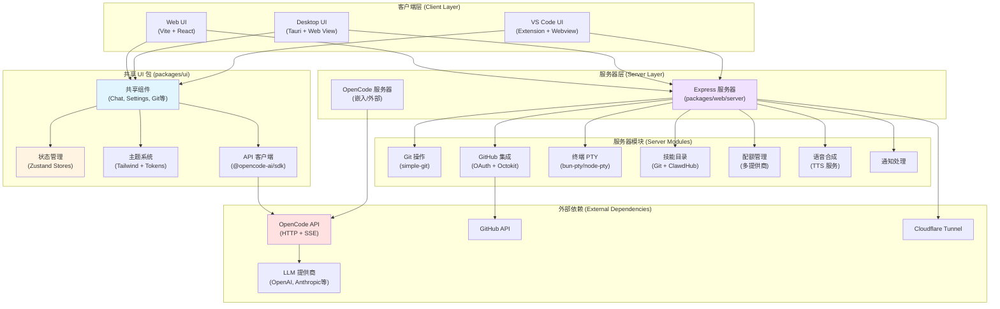

## 运行时架构

### 桌面应用 (Desktop Runtime)

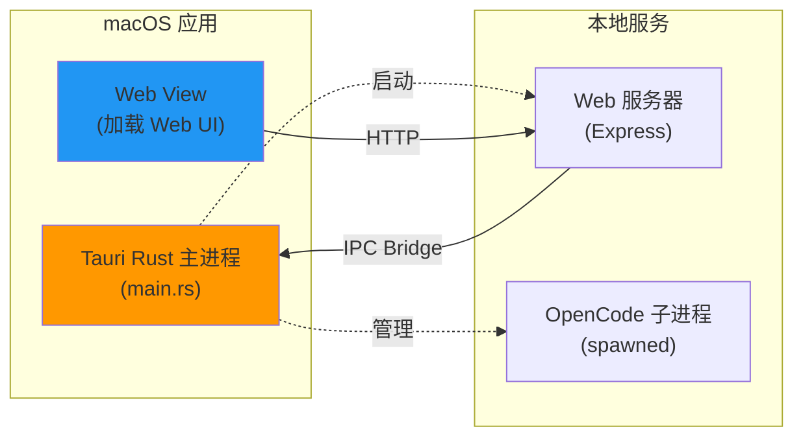

**桌面架构要点：**
- Tauri 仅作为薄壳，提供：菜单、对话框、通知、更新器、深度链接
- 所有业务逻辑在 `packages/web/server/` 中
- Rust 代码通过 Tauri IPC 暴露原生功能（文件选择器、SSH 管理）
- 支持通过 SSH 连接到远程 OpenChamber 实例

### VS Code 扩展 (VS Code Extension)

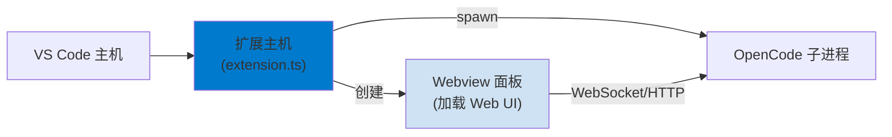

**VS Code 架构要点：**
- 扩展启动独立的 OpenCode 子进程
- 使用 Webview 渲染共享的 React UI
- 支持右键菜单操作：添加上下文、解释代码、改进代码
- 编辑器集成：点击文件路径打开、diff 结果显示

### Web/PWA 运行时 (Web/PWA Runtime)

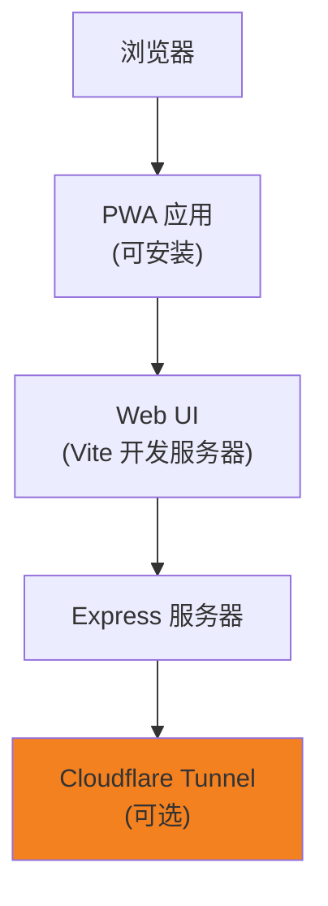

**Web 架构要点：**
- Vite 用于开发构建，生产使用 Express 服务静态文件
- 支持 Cloudflare Tunnel 实现外网访问
- PWA 支持离线使用和安装到主屏幕
- 优化的移动端布局

## 核心模块及职责

### 1. UI 共享包 (`packages/ui`)

**主要职责：**
- 提供所有运行时共享的 React 组件
- 全局状态管理（Zustand stores）
- 主题系统和样式配置
- OpenCode SDK 客户端封装

**关键子模块：**

| 模块 | 路径 | 职责 |
|------|------|------|
| 组件库 | `src/components/` | 所有 UI 组件（聊天、设置、Git、终端等） |
| 状态管理 | `src/stores/` | 40+ Zustand stores，管理会话、消息、配置等 |
| 主题系统 | `src/lib/theme/` | 颜色 token、主题切换、自定义主题 |
| OpenCode 客户端 | `src/lib/opencode/client.ts` | SDK 封装，SSE 事件流处理 |
| 工具库 | `src/lib/` | Git API、工作树、剪贴板、配置同步等 |
| Hooks | `src/hooks/` | 50+ 自定义 hooks（事件流、语音、TTS 等） |

### 2. Web 服务器 (`packages/web/server`)

**主要职责：**
- Express HTTP 服务器
- OpenCode 服务器生命周期管理
- API 端点和 WebSocket 处理
- 文件系统和 Git 操作
- GitHub 集成和 OAuth
- 终端 PTY 管理
- 技能目录管理

**关键模块（`lib/` 目录）：**

| 模块 | 文档 | 职责 |
|------|------|------|
| Git | `lib/git/DOCUMENTATION.md` | Git 操作（仓库、分支、工作树、提交、合并/变基） |
| GitHub | `lib/github/DOCUMENTATION.md` | GitHub OAuth、设备流程、Octokit 客户端 |
| OpenCode | `lib/opencode/DOCUMENTATION.md` | 配置管理、提供商认证、UI 认证 |
| 终端 | `lib/terminal/DOCUMENTATION.md` | WebSocket 终端输入处理、速率限制 |
| 技能目录 | `lib/skills-catalog/DOCUMENTATION.md` | 技能发现、扫描、安装（GitHub + ClawdHub） |
| 配额 | `lib/quota/DOCUMENTATION.md` | 使用配额提供商注册和分发 |
| TTS | `lib/tts/DOCUMENTATION.md` | 文本转语音服务 |
| 通知 | `lib/notifications/DOCUMENTATION.md` | 系统通知消息准备 |

### 3. 桌面应用 (`packages/desktop`)

**主要职责：**
- Tauri 原生应用包装
- 本地 OpenCode 服务器生命周期
- SSH 远程实例管理
- 原生 macOS 功能（菜单、对话框、深度链接）

**关键 Rust 模块：**

| 模块 | 职责 |
|------|------|
| `main.rs` | 主入口、窗口管理、事件处理 |
| `remote_ssh.rs` | SSH 远程实例连接和管理 |

### 4. VS Code 扩展 (`packages/vscode`)

**主要职责：**
- VS Code 扩展主机
- OpenCode 子进程管理
- Webview 面板管理
- 编辑器集成（右键菜单、命令）

## 关键算法和流程设计

### 1. 事件流处理 (Event Streaming)

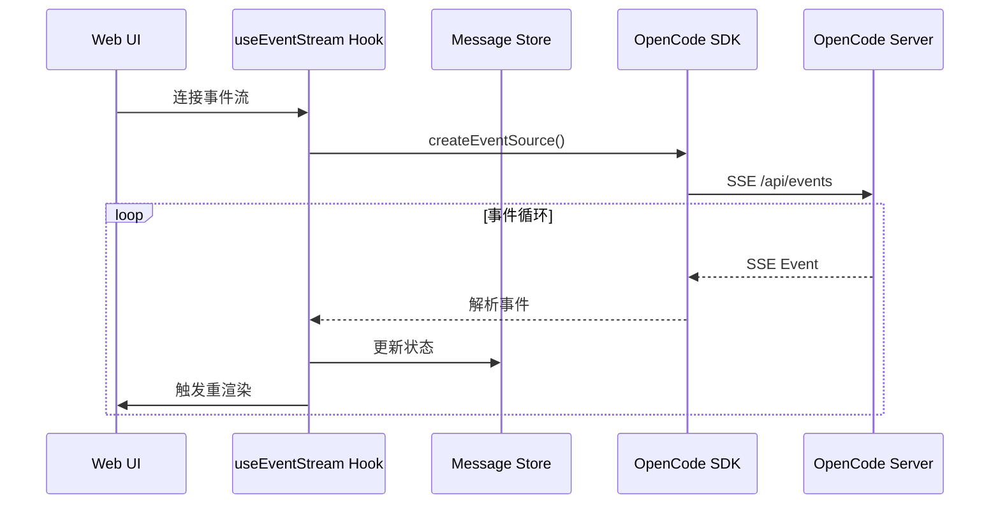

**关键实现：** `packages/ui/src/hooks/useEventStream.ts`

**处理的事件类型：**
- `session.*` - 会话生命周期事件
- `message.*` - 消息创建、更新、删除
- `part.*` - 消息部分（文本、工具输出等）
- `agent.*` - 代理状态变化
- `permission.*` - 权限请求
- `question.*` - 用户问题
- `git.*` - Git 操作事件
- `todo.*` - 任务更新

### 2. 会话分支和撤销/重做

OpenChamber 的核心特性之一是**可分支的聊天时间线**：

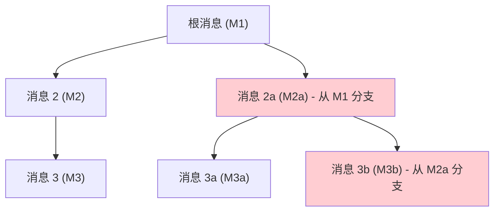

**实现机制：**
- 每条消息记录 `parent_id` 引用父消息
- `forked_from` 标识分支来源
- `/undo` 和 `/redo` 命令导航时间线
- UI 在侧边栏显示完整时间线树

### 3. Git 工作树集成

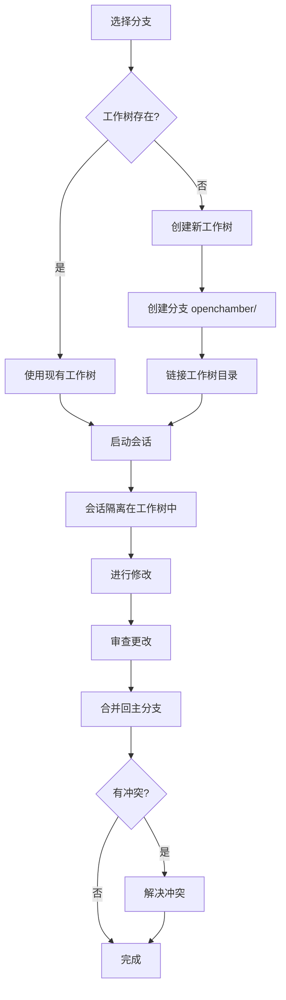

**工作树隔离优势：**
- 多个代理并行运行，互不干扰
- 安全地比较不同方法
- 独立的提交历史

### 4. 多代理并行运行

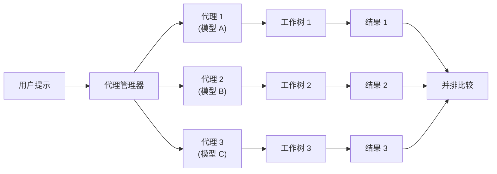

**实现要点：**
- 每个代理分配独立的工作树
- 并行执行，结果独立显示
- 支持并排 diff 比较

### 5. 配置层合并

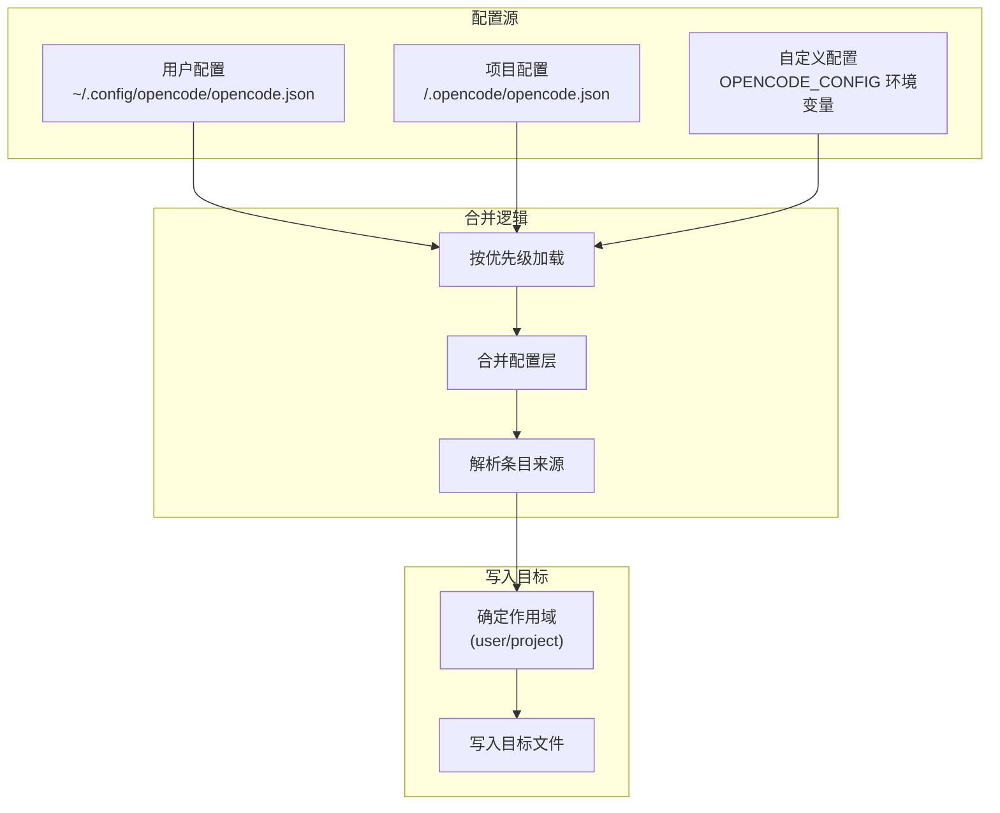

**合并优先级：** 自定义 > 项目 > 用户

**参考实现：** `packages/web/server/lib/opencode/shared.js`

## 数据流和状态管理

### Zustand Store 架构

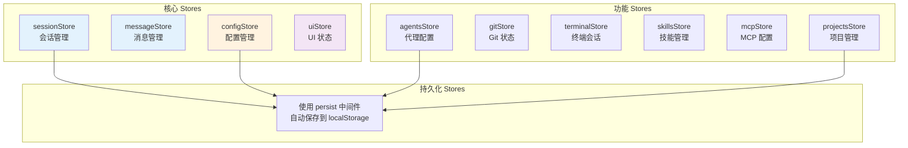

**关键 Store 文件：**

| Store | 路径 | 职责 |
|-------|------|------|
| sessionStore | `stores/useSessionStore.ts` | 会话列表、创建、切换、工作树 |
| messageStore | `stores/messageStore.ts` | 消息队列、游标、读取状态 |
| configStore | `stores/useConfigStore.ts` | OpenCode 配置、提供商标识 |
| agentsStore | `stores/useAgentsStore.ts` | 代理定义、选择器 |
| gitStore | `stores/useGitStore.ts` | Git 状态、分支、提交 |
| terminalStore | `stores/useTerminalStore.ts` | 终端会话、标签页 |
| uiStore | `stores/useUIStore.ts` | UI 布局、侧边栏、面板 |

### 数据流向

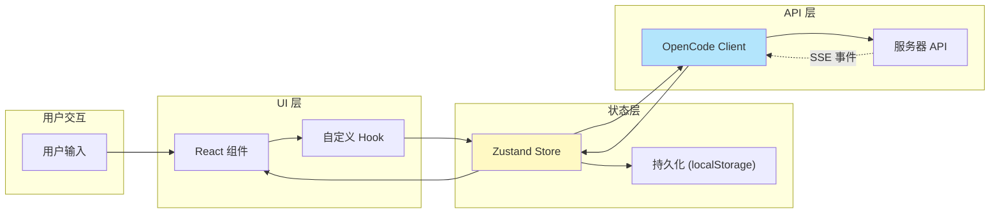

## 外部依赖和集成点

### OpenCode SDK 集成

**位置：** `packages/ui/src/lib/opencode/client.ts`

**依赖：** `@opencode-ai/sdk` (v1.2.20)

**通信协议：**
- HTTP REST API（命令、查询）
- Server-Sent Events（实时事件流）

**关键功能：**
- `createOpencodeClient()` - 创建客户端实例
- `events()` - 建立事件流连接
- `createSession()`, `sendMessage()`, `executeCommand()` 等

### Git 集成

**依赖：** `simple-git` (v3.28.0)

**功能：**
- 仓库状态查询
- 分支/工作树管理
- 提交、推送、拉取
- 合并/变基操作
- 冲突检测和解决

### GitHub 集成

**依赖：** `@octokit/rest` (v22.0.1)

**功能：**
- OAuth 设备流程认证
- Issue 和 PR 操作
- PR 状态检查
- PR 创建和合并

### 终端集成

**依赖：**
- `bun-pty` (v0.4.5) - Bun PTY
- `node-pty` (v1.1.0) - Node PTY
- `ghostty-web` (v0.3.0) - 终端渲染器

**功能：**
- PTY 进程生成
- WebSocket 双向通信
- 多标签页管理
- 每目录会话隔离

### 主题系统

**依赖：**
- Tailwind CSS v4
- `next-themes` (v0.4.6)
- 自定义颜色 token

**功能：**
- 18+ 内置主题
- 自定义 JSON 主题（`~/.config/openchamber/themes/`）
- 热重载，无需重启
- 亮/暗模式切换

### Cloudflare Tunnel 集成

**功能：**
- Quick Tunnel（临时访问）
- Named Tunnel（持久主机名）
- QR 码引导
- 密码保护链接

## 关键设计模式

### 1. 模块化服务器架构

服务器功能按 `lib/` 子目录组织，每个模块有独立的 DOCUMENTATION.md 说明其 API 和用法。

### 2. 共享 UI，多个运行时

- 所有 UI 逻辑在 `packages/ui` 中
- 运行时特定代码最小化
- 通过条件编译和环境变量适配

### 3. 事件驱动状态更新

- SSE 事件流驱动 UI 更新
- Zustand stores 作为单一真相源
- React 组件响应式渲染

### 4. 可扩展的技能系统

- 支持用户和项目作用域
- Git 仓库和 ClawdHub 两种来源
- SKILL.md 元数据格式

### 5. 工作树隔离的代理执行

- 每个代理/分支独立工作树
- 并行执行无冲突
- 安全的实验和比较

## 性能考虑

### 懒加载策略

- 组件代码分割
- 大型 diff 按需加载
- 虚拟化长列表

### 缓存策略

- 技能扫描结果缓存（30分钟 TTL）
- 模型元数据缓存（5分钟 TTL）
- Git 状态轮询节流

### 资源管理

- WebSocket 终端输入速率限制
- PTY 进程清理
- 文件搜索并发限制（5个）

## 安全考虑

### 认证和授权

- OpenCode UI 会话认证（scrypt 密码哈希）
- GitHub OAuth 设备流程
- SSH 密钥管理（Git 操作）

### 输入验证

- 目录路径规范化（防止路径遍历）
- 技能名称验证（模式匹配）
- 命令注入防护（SSH 密钥转义）

### 数据隔离

- 工作树隔离会话
- 每目录终端会话
- 用户/项目配置作用域

## 相关文档

- [项目概览](./01-project-overview.md) - 了解项目定位和目标
- [技术栈](./02-tech-stack.md) - 查看完整的技术栈列表
- [代码结构](./04-code-structure.md) - 深入了解目录组织
- [开发环境搭建](./05-development-setup.md) - 开始本地开发
- [AGENTS.md](../../AGENTS.md) - AI 代理技术架构参考

## 参考资料

- [OpenCode 官方文档](https://opencode.ai)
- [Tauri 文档](https://tauri.app/)
- [Zustand 文档](https://zustand-demo.pmnd.rs/)
- [Mermaid 语法](https://mermaid.js.org/)
